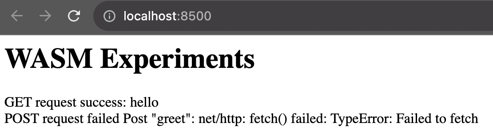

# go1210-request-streaming-failed

This is sample that POST request via http/1 failed on binary built by go1.21.0, because request streaming is not supported via http/1 on Google Chrome. For details, see [issue](https://github.com/golang/go/issues/61889#issuecomment-1684933174).

### requisite
```
% go version
go version go1.21.0 darwin/arm64
```

darwin/arm64 may not be needed.

### how to run

```bash
cp "$(go env GOROOT)/misc/wasm/wasm_exec.js" ./static
GOOS=js GOARCH=wasm go build -o static/main.wasm browser.go && go run server.go -port 8500
```

### result



If run server.go with `-tls` option, the post request will success.
